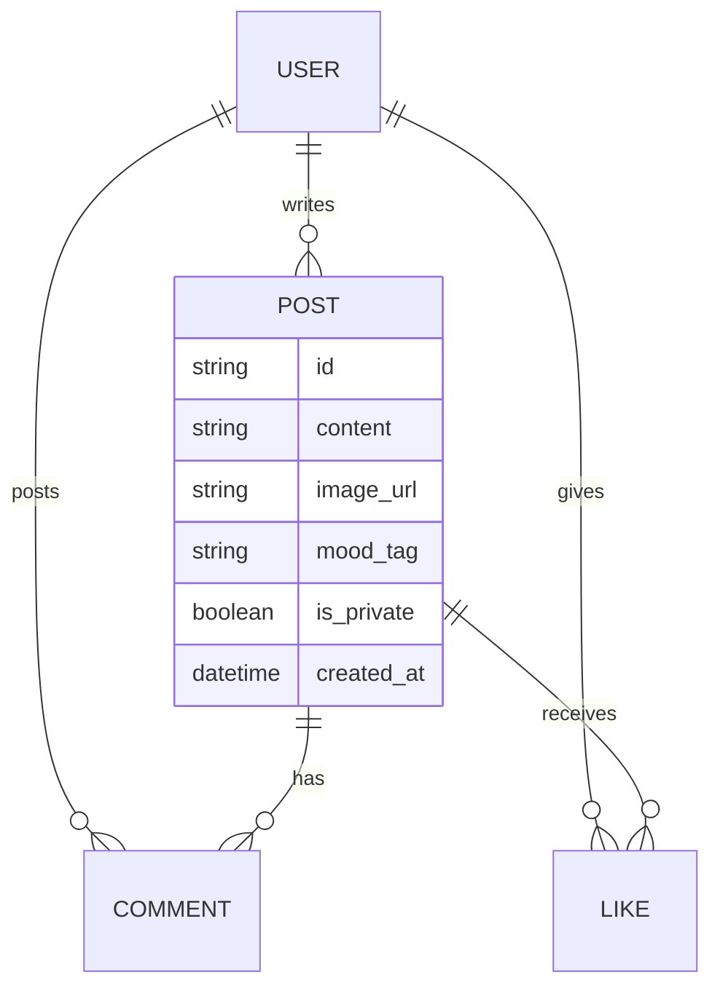

# 产品需求文档 (PRD): 随笔流 (MoodFlow)

## 1. 项目概述

一款基于“偶遇感”的文字分享社交平台。用户通过文字与图片记录心情，主页以随机金句与瀑布流卡片双模呈现，集成 AI 辅助润色与情绪风控。

## 2. 用户角色定义

* **游客 (Guest):** 仅拥有只读权限。可浏览随机句子和卡片流，点击互动操作时触发登录提醒。
* **注册用户 (User):** 拥有发布、点赞、评论、使用 AI 润色、导出个人数据的完整权限。

## 3. 核心功能规范

### 3.1 账号系统

* **登录方式:** 传统的邮箱 + 密码。
* **数据权限:** 用户拥有个人心得的完全所有权，支持一键导出（JSON/Markdown 格式）。

### 3.2 内容发布 (Post)

* **格式:** 纯文字（上限 280 字）+ 允许上传一张配图。
* **分类:** 支持用户自选标签（如 #职场、#恋爱），辅以 AI 自动识别。
* **AI 辅助:** 提供“AI 润色”建议按钮。用户点击后，AI 给出美化后的版本，用户可选择是否替换原稿。

### 3.3 内容展示逻辑

* **随机模式 (Shuffle Mode):** 核心展示页。
* **算法优先级:** `(权重 = 时间衰减 + 点赞数)`。优先推送 24 小时内的高热度内容。
* **交互:** 翻书页动画效果切换下一条。

* **卡片模式 (Feed Mode):** 传统的瀑布流列表。支持无限滚动。

### 3.4 社交互动

* **共鸣 (Like):** 点击图标点赞。
* **评论 (Comment):** 展开式评论区，允许文字交互。

### 3.5 智能风控 (AI Safety)

* **树洞模式:** 经 AI 识别为严重负面情绪或违规的内容，系统不会删除，但会转为“仅自己可见”。

---

## 4. 技术架构与数据设计 (ERD)

### 4.1 核心数据表

---

## 5. 视觉与交互规范 (UI/UX)

* **自适应模式:** 默认跟随系统时间。18:00 - 06:00 强制或建议进入深色模式。
* **响应式:** 移动端优先（Mobile First），PC 端保持最大宽度限制以防视觉发散。
* **关键动画:** 使用 `Framer Motion` 实现模式切换时的“翻书” 3D 转换效果。

---

## 6. 开发分步计划 (Milestones)

### 第一阶段：MVP (最小可行性产品)

1. **环境配置:** Next.js + Prisma + PostgreSQL (Supabase) + NextAuth.js (邮箱登录)。
2. **API 开发:** 登录、发布、获取随机内容。
3. **UI 开发:** 基础布局与随机模式。

### 第二阶段：AI 集成与交互

1. **AI 接入:** 集成 DeepSeek API 处理润色与风控。
2. **社交增强:** 实现点赞与评论功能。
3. **图片处理:** 接入 Supabase Storage 存储用户配图。

### 第三阶段：细节与体验

1. **动画实现:** 翻书效果与模式切换。
2. **数据导出:** 用户数据一键导出功能。
3. **多语言预留:** 引入 `next-intl` 国际化架构。

---

## 接下来如何操作？

我已经为你准备好了这份 PRD。**现在，我们可以开始执行“第一阶段”的任务了。**

**请在 Windsurf 中执行以下步骤：**

1. 将上述 PRD 内容存为 `PRD.md`。
2. 对 Windsurf 说：**“根据 PRD.md 的第一阶段任务，先帮我配置 Next.js 的基础环境，并设置 NextAuth 的邮箱登录基础框架。”**

你要现在就开始初始化项目的代码结构吗？我们可以先从**数据库的 Schema 设计**开始。